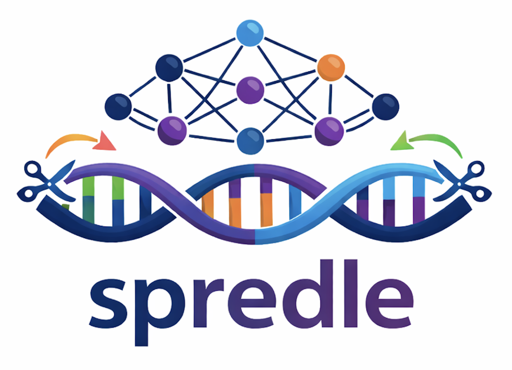

<p align="left">

</p>

# Splicing PREdiction using Deep LEarning (SPREDLE) 

## Overview

spredle is a Python package for predicting RNA splicing from DNA sequences using deep learning. It is designed to first reproduce the [SpliceAI](https://pubmed.ncbi.nlm.nih.gov/30661751/) model (Jaganathan et al., 2019) in PyTorch, rather than the original TensorFlow (v1) implementation, and to adapt it to a regression framework for predicting splicing usage, as demonstrated in [Pangolin](https://pubmed.ncbi.nlm.nih.gov/35449021/). The package then explores additional architectures - such as Transformers and Hyena — with the goal of further improving splicing prediction performance.

Ideally, as the project progresses, spredle will be extended to support training on: (1) individual genomes, with splicing outcomes inferred from matched RNA-seq data; and (2) tissue-specific splicing patterns derived from long-read RNA-seq data.

## Installation

- using conda

```
git clone git@github.com:HaniceSun/spredle.git
cd spredle
conda env create -f environment.yml
conda activate spredle
```

# Quick Start

```
# applied to human data

spredle download-training-data

spredle preprocess --nt 5000 --flank 40

spredle torch-dataset --input Homo_sapiens.GRCh38.115_seq_nt5000_flank40.txt

spredle train --config_file config.yaml --model_name SpliceAI-1 --train_file Homo_sapiens.GRCh38.115_seq_nt5000_flank40_train.pt --val_file Homo_sapiens.GRCh38.115_seq_nt5000_flank40_val.pt --lr_lambda "1,1,1,1,1,1,0.5,0.25,0.125,0.0625,0.03125,0.015625"

spredle train --config_file config.yaml --model_name Hyena-1 --train_file Homo_sapiens.GRCh38.115_seq_nt5000_flank40_train.pt --val_file Homo_sapiens.GRCh38.115_seq_nt5000_flank40_val.pt

spredle predict --config_file config.yaml --model_name SpliceAI-1 --epoch 9 --pred_file predict.txt

# extended to mouse data

spredle download-training-data --genome_reference https://ftp.ensembl.org/pub/current/fasta/mus_musculus/dna/Mus_musculus.GRCm39.dna.primary_assembly.fa.gz  --gene_annotation https://ftp.ensembl.org/pub/current/gtf/mus_musculus/Mus_musculus.GRCm39.115.gtf.gz

spredle preprocess --nt 5000 --flank 5000 --input Mus_musculus.GRCm39.115_seq.txt

spredle torch-dataset --input Mus_musculus.GRCm39.115_seq_nt5000_flank5000.txt

spredle train --config_file config.yaml --model_name SpliceAI-4 --train_file Mus_musculus.GRCm39.115_seq_nt5000_flank5000_train.pt --val_file Mus_musculus.GRCm39.115_seq_nt5000_flank5000_val.pt --lr_lambda "1,1,1,1,1,1,0.5,0.25,0.125,0.0625,0.03125,0.015625"

spredle predict --config_file config.yaml --model_name SpliceAI-4 --epoch 9 --pred_file predict.txt

```

## Author and License

**Author:** Han Sun

**Email:** hansun@stanford.edu

**License:** [MIT License](LICENSE)
